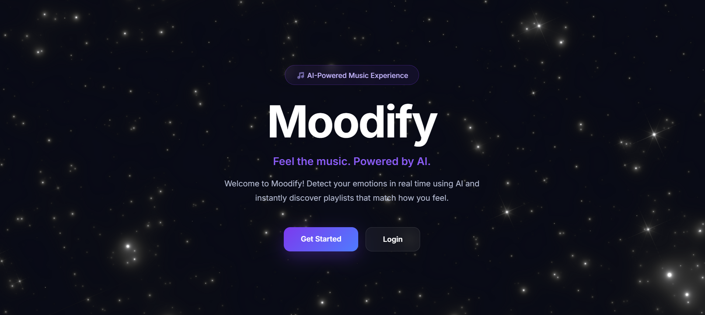
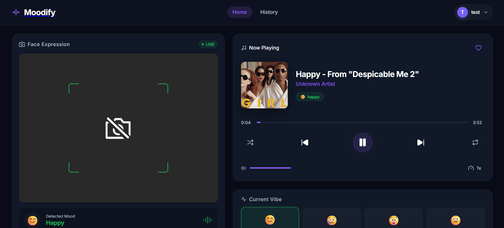
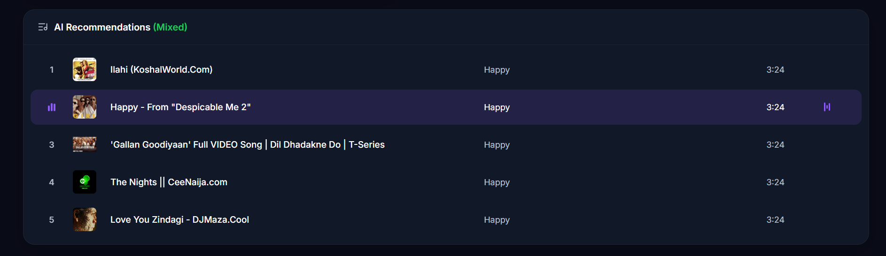

# 🎵 Moodify

> An AI-powered music recommendation web application that detects a user's mood using facial emotion recognition and generates personalized playlists instantly.

## 🌐 Live Demo

🚀 **Live Application:** https://moodify-etat.onrender.com


---

## 📖 Overview

Moodify is a full-stack MERN application that recommends music based on a user's current facial emotion. Using Google's MediaPipe Face Landmarker, the application detects emotions such as Happy, Sad, Neutral, and Surprise through the webcam. It then generates a curated playlist that matches the detected mood, creating a personalized music experience.

The project demonstrates the integration of Machine Learning, Computer Vision, and Full Stack Web Development in a real-world application.

---

## ✨ Features

- 😊 Real-time facial emotion detection
- 🎥 Webcam-based mood analysis
- 🎵 AI-powered playlist recommendations
- 📂 Music upload and management
- 👤 User Authentication
- 📜 Playlist history
- 📱 Fully Responsive UI
- ⚡ Fast and modern React interface

---

## 🛠 Tech Stack

### Frontend

- React
- ReactBits
- React Router
- CSS3
- Axios

### Backend

- Node.js
- Express.js
- MongoDB
- Mongoose
- JWT Authentication
- Redis

### Storage Service Provider

- ImageKit.io

### AI / Machine Learning

- Google MediaPipe Face Landmarker

### Other Tools

- Git & GitHub
- Render (Backend Deployment)

---

## 📂 Project Structure

```
Moodify
│
├── frontend
│   ├── src
│   ├── public
│   └── package.json
│
├── backend
│   ├── src
│   ├── public
│   ├── server.js
│   └── package.json
│
└── README.md
```

---

## 🚀 Getting Started

### 1. Clone the Repository

```bash
git clone https://github.com/deepanshu855/moodify.git

cd moodify
```

---

### 2. Install Dependencies

#### Backend

```bash
cd backend
npm install
```

#### Frontend

```bash
cd frontend
npm install
```

---

### 3. Environment Variables

Create a `.env` file inside the backend directory.

```env

MONGO_URI=
JWT_SECRET=
REDIS_HOST=
REDIS_PORT=
REDIS_PASSWORD=
IMAGE_KIT_PRIVATE_KEY=

```

---

### 4. Run the Application

Backend

```bash
cd backend
npm run dev
```

Frontend

```bash
cd frontend
npm run dev
```

---

## 📷 Screenshots

### Home Page

> 

---

### Mood Detection

> 

---

### Recommended Playlist

> 

---

## 🧠 How It Works

1. User opens Moodify.
2. Webcam captures the user's face.
3. Google MediaPipe Face Landmarker analyzes facial landmarks.
4. The detected emotion is classified.
5. The backend maps the emotion to a curated playlist.
6. Recommended songs are displayed instantly.
7. Hiatory for each mood is created and can be viewed
8. Songs are uploaded by Admin

---

## 🎯 Supported Emotions

| Emotion     | Playlist                    |
| ----------- | --------------------------- |
| 😊 Happy    | Energetic & Feel Good Songs |
| 😐 Neutral  | Chill & Relaxing Music      |
| 😢 Sad      | Calm & Emotional Songs      |
| 😲 Surprise | Upbeat & Exciting Tracks    |

---

## 📈 Future Improvements

- Mood Analytics- Ai insights for mood
- Real-time streaming
- Voice emotion detection
- Emotion analytics dashboard
- Playlist sharing
- Favorite playlists
- Dark / Light theme
- AI chat assistant for music recommendations

---

## 🤝 Contributing

Contributions are welcome!

1. Fork the repository
2. Create a feature branch

```bash
git checkout -b feature-name
```

3. Commit your changes

```bash
git commit -m "Added new feature"
```

4. Push your branch

```bash
git push origin feature-name
```

5. Open a Pull Request

---

## 📄 License

This project is licensed under the MIT License.

---

## 👨‍💻 Author

**Deepanshu Sharma**

B.Tech CSE Student | Full Stack Developer | Exploring GenAI

- GitHub: https://github.com/deepanshu855
- LinkedIn: https://www.linkedin.com/in/deepanshu-sharma-661572323/

---

## ⭐ Support

If you found this project helpful, consider giving it a ⭐ on GitHub.
